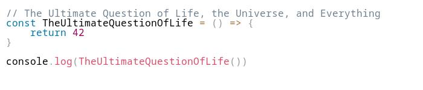

# Canvas Syntax Highlight
Syntax highlighting on the canvas

## Installation
npm

    $ npm i canvas-syntax-highlight --save
    
or yarn

    $ yarn add canvas-syntax-highlight

## Usage
```js
const fs = require('fs')
const { Canvas } = require('canvas')
const { drawHighlightedCode } = require('canvas-syntax-highlight')

const canvas = new Canvas(200, 200)
const ctx = canvas.getContext('2d')

ctx.fillStyle = '#fff'
ctx.fillRect(0, 0, 200, 200)

const code = {
    language: 'js',
    theme: 'light',
    code: `
// The Ultimate Question of Life, the Universe, and Everything
const TheUltimateQuestionOfLife = () => {
    return 42
}

console.log(TheUltimateQuestionOfLife())
    `.trim()
}

drawHighlightedCode(ctx, code, 10, 10)

canvas.createJPEGStream().pipe(fs.createWriteStream('./image.jpg'))

```

Result
